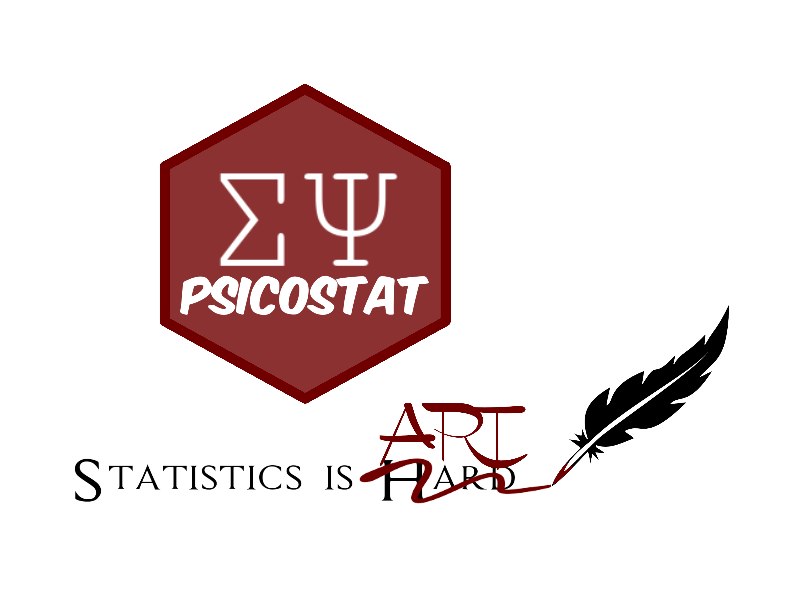

```{r setup, include=FALSE}
knitr::opts_chunk$set(echo = TRUE)
```

# R Markdown

This is an R Markdown document. Markdown is a simple formatting syntax for authoring HTML, PDF, and MS Word documents. For more details on using R Markdown see <http://rmarkdown.rstudio.com>.

When you click the **Knit** button a document will be generated that includes both content as well as the output of any embedded R code chunks within the document. You can embed an R code chunk like this:

```{r cars}
summary(cars)
```

## Including Plots

You can also embed plots, for example:

```{r pressure, echo=FALSE}
plot(pressure)
```

Note that the `echo = FALSE` parameter was added to the code chunk to prevent printing of the R code that generated the plot.

# Content Hyperlinks

## Sections {#my-section}

See Section \@ref(my-section)

## Figures

### Pictures

See Figure \@ref(fig:psicostat-logo). Note: in chunks name do not use "_" but use "-" instead.     `\@ref(fig:psicostat_logo)` do not work, `\@ref(fig:psicostat-logo)` works properly.

```{r psicostat-logo, fig.cap = "Logo Psicostat", out.width = '33%'}

```

### Plots

See Figure \@ref(fig:my-plot)

```{r my-plot, fig.cap = "Random numbers", out.width = '50%'}
plot(rnorm(10))
```

## Tables

See r-package `kableExtra` documentation (link)[https://cran.r-project.org/web/packages/kableExtra/vignettes/awesome_table_in_html.html] 


See Tabele \@ref(tab:cars-table)

```{r cars-table}
data(iris)

knitr::kable(iris[1:5,], caption = "Una esempio di tabella")
```

# APA cls

We are using apa 7 cls format. [@fisherFrequencyDistributionValues1915] 

# References {-}

